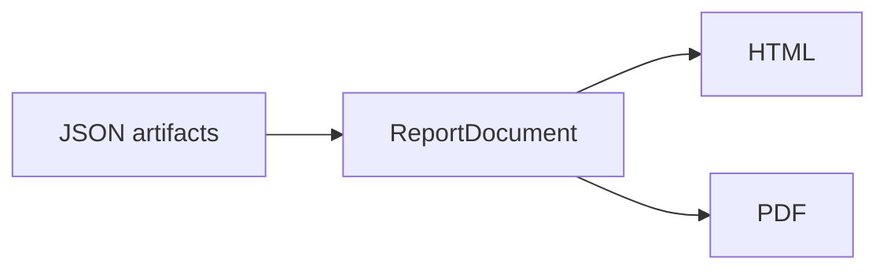

# Energy & reports

Energy backends and HTML/PDF reports for **CompilerSutraPerf** 0.2.0 ([PyPI: `compilersutra-perf`](https://pypi.org/project/compilersutra-perf/)).

## Energy

Results land in the top-level `power` block. Energy is **on by default** when a backend is available.

```python
csperf list-energy-backends

csperf run --input examples/cpp/matrix_traversal.cpp --backend cpu --no-perf
csperf run --input examples/cpp/matrix_traversal.cpp --backend cpu --no-energy
csperf run --input examples/cpp/matrix_traversal.cpp --backend cpu \
  --energy-backend amd-cpu --output results/cpu-energy.json
```

| Flag | Meaning |
| --- | --- |
| `--energy` | Force enable (default when available) |
| `--no-energy` | Skip all energy backends |
| `--energy-backend` | `auto`, `amd-cpu`, `amd-gpu`, … |

Manifest: `"use_energy": true`, `"energy_backends": "auto"`.

### Backends (0.2.0)

| Backend | Domain | Platform | Mechanism |
| --- | --- | --- | --- |
| `amd-cpu` | CPU package | Linux | RAPL via `perf` `power/energy-pkg/` |
| `amd-gpu` | GPU | Linux HIP | `rocm-smi --showpower` |
| `macos-cpu` | CPU package | macOS | powermetrics |

Stubs (`intel-cpu`, `nvidia-gpu`, `external-meter`) show as unavailable until implemented.

### Linux RAPL

```python
sudo sysctl kernel.perf_event_paranoid=-1
```

If `perf` hits LLVM symbol errors:

```python
export LD_LIBRARY_PATH=/usr/lib/x86_64-linux-gnu
```

### How to read `power.domains[]`

- `energy_j`, `avg_power_w`  
- `domain`, `backend`, `same_execution`  

Package RAPL is **not** per-process energy.

Example:

```text
power: collected
  cpu_package: energy_j=0.842, avg_power_w=12.8 W, source=perf, same_execution=true
```

With opt sweeps:

```python
csperf run --input examples/cpp/matrix_traversal.cpp --diff-optimize --no-perf
```

Compare runtime (and energy when collected) across the generated JSON/CSV files.

## Reports



```python
csperf visualize results/cpu.json --output results/report.html
pip install 'compilersutra-perf[pdf]'
csperf visualize results/cpu.json --format pdf --output results/report.pdf
csperf visualize results/cpu.json --format both --output results/report
csperf list-report-formats
```

| Section | Content |
| --- | --- |
| `core` | timing, metrics, trials (single + comparison) |
| `energy` | `power` domains when present |

| Extra | Enables |
| --- | --- |
| `[visualize]` | HTML + Streamlit `dashboard` |
| `[pdf]` | WeasyPrint |
| `[excel]` | XLSX |

```python
csperf visualize results/cpu.json results/hip.json --output results/cmp.html
csperf dashboard results/cpu.json results/hip.json
```

## See also

- [Methodology](/docs/project/compilersutra-perf/methodology/)  
- [Troubleshooting](/docs/project/compilersutra-perf/troubleshooting/)  
- [Usage](/docs/project/compilersutra-perf/usage/)  
