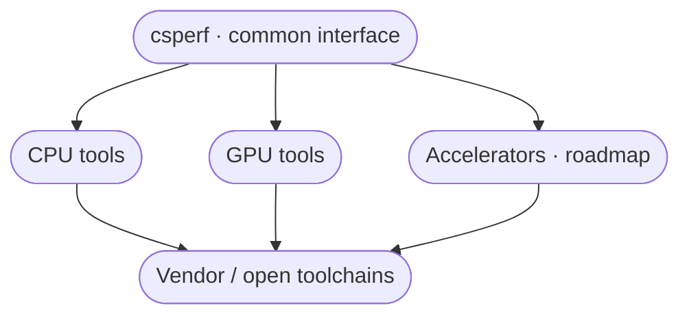
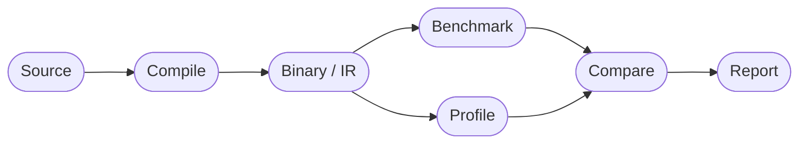

# Observatory

Research framing for **CompilerSutraPerf** (`csperf`, [PyPI: `compilersutra-perf`](https://pypi.org/project/compilersutra-perf/)). This is the north star. Alpha **0.2.0** already ships the Linux CPU path; GPU and static-analysis pieces grow toward this vision.

## Problem

Hardware ecosystems are fragmented. Each CPU/GPU stack brings its own compiler, IR, profiler, SDK, and scripts. A simple loop — compile → inspect → benchmark → compare — becomes a different workflow per platform, hard to reproduce, and easy to mislabel (static estimates presented as measured performance).

## Approach

**Do not reinvent the compiler ecosystem. Integrate and orchestrate it.**



`csperf` provides: unified CLI, experiment config, result collection, a common schema, `diff` / `--diff-optimize`, and reports. Vendor tools still do the architecture-specific work (Clang/GCC, HIP/ROCm, OpenCL, Vulkan, `perf`, …).

## Evidence labels

Different numbers are different kinds of evidence. Keep them labeled:

| Label | Examples |
| --- | --- |
| **Hardware measurement** | Wall time, `perf` / PAPI, rocprof, RAPL |
| **Model-based estimation** | `llvm-mca`, cost models (roadmap) |
| **Static analysis only** | IR/asm size, instruction count (roadmap) |

Never present theoretical analysis as measured hardware performance. Never claim GPU speed without running on that GPU. Details: [Methodology](/docs/project/compilersutra-perf/methodology/).

## What you can run today (0.2.0)

```python
pip install compilersutra-perf
csperf doctor
csperf quickstart --output-dir results/quickstart

csperf run --input examples/cpp/matrix_traversal.cpp --backend cpu \
  --warmup-runs 1 --repeat-runs 3 --output results/cpu.json

csperf profile results/cpu.json
csperf diff results/run-a.json results/run-b.json --csv results/compare.csv

csperf run --input examples/cpp/matrix_traversal.cpp \
  --diff-optimize --no-perf --report-format both
```

| Concern | Status now |
| --- | --- |
| Common CLI | Shipped |
| CPU compile / run / profile | Solid on Linux |
| HIP / OpenCL / Vulkan | Experimental (Vulkan = validate) |
| Result schema + diff + HTML/PDF | Shipped |
| Energy backends | Partial (RAPL / AMD GPU / macOS) |
| LLVM discovery, asm / llvm-mca suites | Planned |
| Android / embedded telemetry | Planned |

## Target workflow



IR emission (clang) is best-effort today. Full assembly extraction, static instruction metrics, and `llc`-driven AMDGPU/RISC-V suites are roadmap work.

## Roadmap (milestones)

| Milestone | Theme |
| --- | --- |
| **0.2.0** (shipped) | run / profile / diff / report, energy, quickstart, honesty docs |
| **0.3.0** | Plugins, schema, registries |
| **0.4.0** | Observatory MVP: LLVM discovery, IR/asm JSON, first static experiments |
| **0.5.0** | Asm analyzer, llvm-mca, research Markdown reports |
| **0.6.0** | Regression taxonomy, A-vs-B research diffs, vendor reports |
| **0.7.0** | Android / embedded field telemetry |

## Vision (one line)

> A unified experimentation and analysis layer across heterogeneous CPU, GPU, and accelerator toolchains — integrating existing tools rather than replacing them.

## See also

- [Getting started](/docs/project/compilersutra-perf/getting-started/)  
- [Architecture](/docs/project/compilersutra-perf/architecture/) — how the current MVP is built  
- [Methodology](/docs/project/compilersutra-perf/methodology/) — measurement honesty  
- [Usage](/docs/project/compilersutra-perf/usage/) — CLI surface today  
