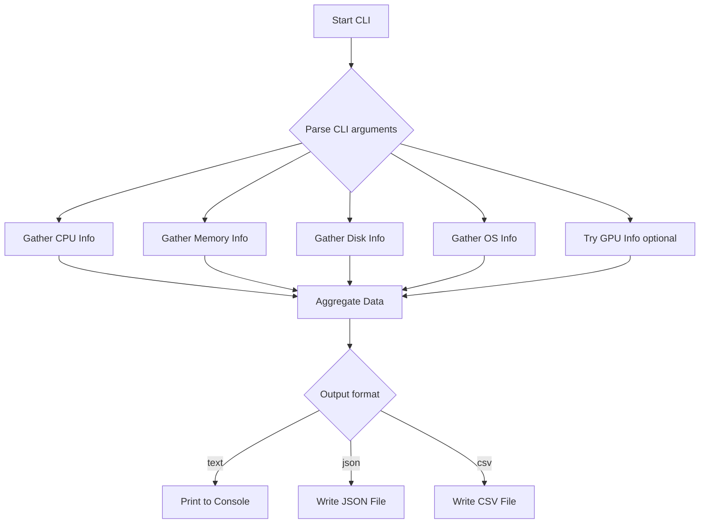

# 🔤 System Specs Collector

A **Python-based CLI tool** designed to collect system specifications like CPU, memory, disk, OS, and GPU information. Supports multiple output formats and features a clean, testable structure.

---

## 🧭 Table of Contents

- [Project Structure](#-project-structure)
- [Workflow Diagram](#-system-workflow-mermaid)
- [How It Works](#-how-the-code-works-algorithmic-breakdown)
- [Installation](#-installation)
- [Usage](#-usage)
- [Output Examples](#-output-examples)
- [Libraries Used](#-utility-libraries-used)
- [Running Tests](#-running-tests)
- [Features](#-features)
- [Cross-Platform Support](#-cross-platform-support)
- [Learning Path](#-beginner-to-expert-path)
- [Contributing](#-contributing)
- [License](#-license)

---

## 📁 Project Structure

```plaintext
system-specs-collector/
├── LICENSE
├── README.md
├── pyproject.toml
├── requirements.txt
├── system_specs_collector/
│   ├── __init__.py
│   ├── cli.py
└── tests/
    ├── test_basic.py
```

---

## 📈 System Workflow (Mermaid Diagram)



---

## 🧠 How the Code Works (Algorithmic Breakdown)

### ✅ Step 1: Initialization
- Imports standard and optional libraries
- Checks if `GPUtil` is available

### ✅ Step 2: Data Collection Functions
Each function gathers one component:
- `get_cpu_info()` – core count, frequency, usage
- `get_memory_info()` – memory stats
- `get_disk_info()` – disk partitions, usage
- `get_os_info()` – OS name and version
- `get_gpu_info()` – only if `GPUtil` is installed

### ✅ Step 3: Aggregate Info
- `collect_all_info()` returns a complete dictionary of all collected specs

### ✅ Step 4: Output Options
- `--format`: choose `text`, `json`, or `csv`
- `--output`: specify output filename

### ✅ Step 5: Export/Display
- `print_human_readable()` for terminal
- `save_to_json()` and `save_to_csv()` for files

---

## 🛠️ Installation

import Tabs from '@theme/Tabs';
import TabItem from '@theme/TabItem';

<Tabs>
<TabItem value="mac-linux" label="Mac/Linux" default>

```bash
git clone https://github.com/aabhinavg1/automate_boring_stuff.git
cd automate_boring_stuff/system-specs-collector
python -m venv venv
source venv/bin/activate
pip install -r requirements.txt
```

</TabItem>
<TabItem value="windows" label="Windows (WSL Recommended)">

```bash
git clone https://github.com/aabhinavg1/automate_boring_stuff.git
cd automate_boring_stuff/system-specs-collector
python -m venv venv
venv\Scripts\activate
pip install -r requirements.txt
```

</TabItem>
</Tabs>

---

## 🧪 Usage

<Tabs>
<TabItem value="basic" label="Basic">

```bash
 python ./system_specs_collector/cli.py --help

usage: cli.py [-h] [-f {csv,json,text}] [-o OUTPUT] [-v]

System Specs Collector - Gather comprehensive system information

options:
  -h, --help            show this help message and exit
  -f {csv,json,text}, --format {csv,json,text}
                        Output format (default: text)
  -o OUTPUT, --output OUTPUT
                        Output filename without extension (default: system_specs)
  -v, --version         show program's version number and exit

Use case: system_specs.py -f json -o system_info
```

</TabItem>
<TabItem value="custom-output" label="Custom Format/File">

```bash
python ./system_specs_collector/cli.py -f csv -o eg.csv
```

</TabItem>
</Tabs>

### Available Arguments

| Argument      | Description                         | Default        |
|---------------|-------------------------------------|----------------|
| `--format`    | Output format: `text`, `json`, `csv`| `text`         |
| `--output`    | Output filename (no extension)      | `system_specs` |

---

## 📂 Output Examples

### JSON Output:
```json
{
  "CPU": {
    "physical_cores": 4,
    "logical_cores": 8
  },
  "Memory": {
    "total": "16 GB",
    "available": "8.7 GB"
  }
}
```

### CSV Output:
```csv
component,key,value
CPU,physical_cores,4
CPU,logical_cores,8
Memory,total,16 GB
Memory,available,8.7 GB
```

---

## 📚 Utility Libraries Used

- `psutil` — system utilization
- `GPUtil` — GPU stats (optional)
- `platform` — OS detection
- `argparse` — CLI argument parser
- `csv`, `json` — export formatting

---

## 🧪 Running Tests

```bash
python -m unittest discover tests
```

---

## 💡 Features

- ✅ Collect CPU, Memory, Disk, OS info
- ✅ Optional GPU (NVIDIA) info
- ✅ Supports output in `text`, `json`, `csv`
- ✅ Modular, testable code
- ✅ CLI-automatable and script-friendly

---

## 🌍 Cross-Platform Support

- ✅ Linux
- ✅ macOS
- ✅ Windows (WSL preferred)

---

## 🧠 Beginner to Expert Path

| Level       | Learn About                                                  |
|-------------|--------------------------------------------------------------|
| 🟢 Beginner  | Run CLI, export local system specs                           |
| 🟡 Intermediate | Add collectors (battery, network, sensors)               |
| 🔴 Expert    | CI/CD integration, dashboards, automation in pipelines      |

---

## 🤝 Contributing

1. Fork the repository  
2. Create a new branch: `git checkout -b feature/xyz`  
3. Commit changes: `git commit -m 'Add new feature'`  
4. Push branch: `git push origin feature/xyz`  
5. Open a Pull Request

---

## 📜 License

MIT License — see [LICENSE](./LICENSE) for details.

---

## 🌟 Like This Tool?

Star ⭐ it, share 🔁 it, or contribute 👨‍💻 to improve it!

---

## 💬 Want More Features?


Let us know or submit a PR!

