# Introduction to TVM

Apache TVM is an open-source machine learning compiler framework that enables efficient execution of deep learning models on various hardware platforms. It is designed to optimize and deploy machine learning models across diverse hardware architectures such as CPUs, GPUs, and specialized accelerators.

## Why Was TVM Created?
As AI adoption grows it has now become essential to include AI in the wide diversity of the hardware devices.
But the problem here is the AI framework rely on the vendor-specific libraries, thats the reason deploying the AI workload on the new platform such as phones , embedded device etc requires significant manual effort.

:::tip Solution of the Problem
To solve this their was a proposal of the TVM(Tensor Virtual Machine) It is started as a reaserch project in [SAMPL grp](https://sampl.cs.washington.edu/). 

The main and intial aim of the TVM was to bridge the gap between deep learning framework and hardware accelarators which will make AI models more efficient across different devices.

After that, in 2019, TVM became an Apache Incubator project under the Apache Software Foundation (ASF). It has since evolved into a widely used open-source deep learning compiler stack, enabling efficient model deployment on CPUs, GPUs, and specialized accelerators.


#### 🔍 Insights:
- Identifying the most **expensive passes** helps in tuning LLVM optimizations for performance improvements.  
- Depending on the **target architecture and workload**, tweaking pass order or selectively disabling costly passes may enhance compilation efficiency.  
- Before TVM, deploying deep learning models required manually optimizing code for different hardware backends such as NVIDIA GPUs, ARM CPUs, or custom accelerators. Traditional deep learning frameworks like TensorFlow and PyTorch were often tied to specific hardware vendors and lacked efficient cross-platform portability.
- TVM fix the optimization problem specific to the deep learning workloads such as ``high-level operator fusion``, ``mapping latency hiding``, ``mapping to arbitary  h/w primitives`` , and ``memory latency`` . Along with handling optimization TVM automates optimization of low level programs to hardware characteristic by helping to implementing a novel learning based cost model method for rapid exploration of code optimization.
:::

## TVM Optimization Pipeline  

The TVM optimization pipeline consists of three main stages:  

### 1. Frontend (Model Ingestion)  
   - This stage is responsible for importing and parsing models from various deep learning frameworks such as TensorFlow, PyTorch, ONNX, and MXNet.  
   - The imported model is converted into TVM’s internal computational graph representation, called **Relay IR** (Intermediate Representation).  
   - This step ensures framework-agnostic processing of models for further optimizations.  

### 2. Middle-End (Graph Optimizations)  
   - The computational graph undergoes several optimizations to improve performance and efficiency.  
   - Common optimizations include:  
     - **Operator fusion**: Combining multiple operations into a single kernel for better execution.  
     - **Constant folding**: Precomputing constant expressions at compile time.  
     - **Dead code elimination**: Removing unnecessary operations.  
     - **Layout transformations**: Reordering data layouts for improved memory access patterns.  
   - These optimizations help reduce computation time and improve memory efficiency before code generation.  

### 3. Backend (Target-Specific Code Generation)  
   - In this stage, the optimized computation graph is transformed into low-level code tailored for specific hardware targets.  
   - TVM supports various hardware backends, including CPUs, GPUs, FPGAs, and specialized accelerators like CUDA, ROCm, and Metal.  
   - The generated code is further optimized using:  
     - **Auto-tuning**: Searching for the best possible kernel configurations.  
     - **Low-level scheduling**: Optimizing execution patterns for hardware efficiency.  
   - Finally, the compiled module is packaged for deployment on the target device.  

The diagram below illustrates this workflow:

### TVM Optimization Pipeline (Diagram)

```mermaid
graph TD;
    
    %% Frontend Section
    subgraph Frontend [Frontend: Model Processing 🎯]
        X[📥 Deep Learning Model] -->|🔄 Convert to Relay IR| Y[⚡ Relay Optimizations]
    end

    %% Middle-end Section
    subgraph Middleend [Middle-end: Compilation & Optimization 🚀]
        Y -->|📊 Graph-Level Optimizations| Y1[🔧 Operator Fusion & Simplification]
        Y1 -->|📉 Lowering to TE IR| Z[💾 Tensor Expression IR]
    end

    %% Backend Section
    subgraph Backend [Backend: Code Generation & Deployment 🏗️]
        Z -->|⚙️ Device-Specific Code Generation| W[🚀 Optimized Execution]
        W -->|📡 Deploy on Target Device| V[📡 CPU / GPU / TPU / FPGA / Embedded Devices]
    end

    %% Auto-tuning Path
    Y1 -.->|🤖 AutoTVM & AutoScheduler| Z
    Z -.->|📌 Ahead-of-Time Compilation| W

    %% Styling Enhancements
    classDef highlight fill:#FFD700,stroke:#333,stroke-width:2px,font-size:16px;
    classDef process fill:#4CAF50,stroke:#fff,stroke-width:2px,color:#fff,font-size:14px;
    classDef compute fill:#2196F3,stroke:#fff,stroke-width:2px,color:#fff,font-size:14px;
    classDef deploy fill:#FF5722,stroke:#fff,stroke-width:2px,color:#fff,font-size:14px;

    class X highlight;
    class Y process;
    class Y1 process;
    class Z compute;
    class W deploy;
    class V deploy;

```


## Challenges Before TVM
Deep learning model were able to recognize the images process natural language , and also claming to defeat human in startegic game. Because of such a great capabilties its demand to deploy smart application with AI support is increasing.

However, deploying deep learning models on different types of devices is a major challenge. These devices range from self-driving cars and embedded systems to cloud servers and security applications and this will add on. Each of them uses different types of hardware, such as CPUs, GPUs, and FPGAs, which makes it difficult to optimize a single deep learning model to run efficiently everywhere.

One of the biggest challenges is that different hardware has different architectures, memory systems, and processing capabilities. A model optimized for a high-performance GPU may not work well on a power-limited embedded system. Some devices need low power consumption, while others require high-speed processing. This creates a need for customized optimization for each platform, which can be time-consuming and complex.

Another challenge is that deep learning frameworks like TensorFlow, PyTorch, MXNet, and Caffe all have their own ways of representing and optimizing models. Some use computational graphs, while others rely on operations. Since there is no universal optimization method, developers often struggle to make their models run efficiently on different hardware.

Due to these difficulties, there is a need for a unified solution that can optimize deep learning models across different devices and frameworks without requiring manual tuning for each platform. 

This is where TVM comes into play.
graph intermediate representation and some DL framework rely on the graph and operation


- **Hardware Fragmentation**: Different hardware architectures require different optimization techniques.
- **Manual Tuning Complexity**: Optimizing deep learning models for performance across different devices is tedious.
- **Lack of Unified Compilation**: No single framework could efficiently compile models for all backends.
- **Performance Bottlenecks**: Existing deep learning frameworks had overheads that made it difficult to achieve peak hardware performance.
##### How TVM Solves These Problems

Deploying deep learning models efficiently across different hardware platforms is a major challenge due to varying architectures, performance constraints, and vendor-specific dependencies. TVM solves these problems by providing an automated and efficient machine learning compiler that optimizes models for multiple hardware backends without requiring extensive manual tuning. It ensures that deep learning applications can run efficiently on CPUs, GPUs, FPGAs, and specialized accelerators, making AI deployment seamless across edge devices, embedded systems, and cloud services.

TVM achieves this by:  

- **Optimizing performance across multiple hardware platforms** – It generates highly efficient code for diverse hardware, ensuring better speed, reduced memory usage, and improved execution times.  
- **Automatically tuning deep learning models for efficiency** – TVM includes an auto-tuning framework that explores different scheduling strategies to find the most efficient execution plan for each model.  
- **Reducing dependence on vendor-specific software** – Unlike many deep learning frameworks that rely on proprietary vendor libraries, TVM is open-source and works independently across different hardware ecosystems.  
- **Providing an extensible system for compiler optimizations** – Developers can customize TVM to fine-tune performance based on specific workloads, making it adaptable to research and production needs.  
- **Supporting multiple deep learning frameworks** – TVM allows seamless integration with frameworks like TensorFlow, PyTorch, MXNet, and ONNX, ensuring flexibility in model deployment.  
- **Improving model portability and deployment** – With TVM, AI models can be deployed efficiently across different devices without significant modifications, making it ideal for cloud, mobile, and embedded AI applications.  
- **Utilizing graph-level and tensor-level optimizations** – TVM optimizes computational graphs, schedules memory layouts efficiently, and applies tensor optimizations to maximize hardware performance.  

##### Comparison: Without TVM vs. With TVM

| Feature                      | Without TVM                                      | With TVM                                           |
|------------------------------|-------------------------------------------------|----------------------------------------------------|
| **Hardware Compatibility**    | Requires manual tuning for different hardware  | Works seamlessly across CPUs, GPUs, FPGAs, etc.  |
| **Performance Optimization**  | Limited optimization, often vendor-dependent    | Auto-tuning optimizes for efficiency and speed   |
| **Framework Support**         | Tied to specific frameworks                     | Supports TensorFlow, PyTorch, ONNX, and more    |
| **Portability**               | Models require modifications for each device   | Deploys across devices without major changes    |
| **Vendor Dependence**         | Uses proprietary vendor software                | Open-source and vendor-independent              |
| **Automation**                | Manual tuning required                          | Auto-schedules and optimizes models automatically |
| **Code Generation**           | May produce inefficient code                    | Generates optimized machine code for hardware   |
| **Scalability**               | Limited to specific environments                | Scales from edge devices to cloud infrastructure |

By offering a unified, automated, and highly efficient approach to deep learning model optimization, TVM simplifies AI deployment across a wide range of devices and accelerates innovation in machine learning applications.  


### Why Use TVM?


TVM is a powerful deep learning compiler framework designed to optimize and deploy machine learning models across a wide range of hardware platforms. It is **hardware-agnostic**, meaning it supports multiple backends such as x86, ARM, CUDA, Vulkan, Metal, and specialized accelerators like TPUs. One of its key advantages is **optimization**, as it generates highly efficient code that reduces latency and improves throughput, ensuring better performance across different devices. TVM also brings **automation** to the model optimization and deployment process, eliminating the need for extensive manual tuning. Its **extensibility** allows developers to customize and fine-tune it for specific hardware and workloads, making it highly adaptable to various use cases. Being an **open-source** project under the Apache Foundation, it benefits from continuous community contributions and improvements. Additionally, TVM provides **cross-framework support**, enabling seamless integration with deep learning frameworks like TensorFlow, PyTorch, and ONNX. It also offers **automatic tensor optimizations**, **graph-level transformations**, and **hardware-specific code generation**, allowing deep learning models to achieve near-ideal performance on any given hardware. With its ability to optimize models for cloud, edge, and embedded systems, TVM is an essential tool for efficient AI deployment.  

- **Hardware Agnostic**: Supports multiple hardware backends including x86, ARM, CUDA, Vulkan, Metal, and specialized accelerators like TPUs.
- **Optimization**: Provides efficient code generation, reducing latency and improving throughput.
- **Automation**: Automates the process of optimizing and deploying ML models.
- **Extensibility**: Can be customized for specific hardware and workloads.
- **Open-Source**: Developed as part of the Apache Foundation, ensuring community contributions and continual improvements.


# Installing TVM

    To install TVM, follow these steps:

    ```cpp
    git clone --recursive https://github.com/apache/tvm.git
    cd tvm
    mkdir build
    cp cmake/config.cmake build/
    cd build
    cmake ..
    make -j$(nproc)
    ```

## TVM Architecture Overview

TVM consists of several key component which we will discuss in upcoming article in detial:

- **Relay**: An intermediate representation (IR) for deep learning models.
- **Tensor Expression (TE)**: A domain-specific language for expressing tensor computations.
- **AutoTVM**: A system for automatic performance tuning.
- **VTA (Versatile Tensor Accelerator)**: A hardware abstraction for accelerating ML workloads.
- **BYOC (Bring Your Own Codegen)**: A mechanism to integrate custom hardware backends.
- **TVMC (TVM Command Line Interface)**: A simple way to compile and deploy models without writing Python code.


## References

1. [Tianqi Chen et al., "TVM: An Automated End-to-End Optimizing Compiler for Deep](https://www.usenix.org/system/files/osdi18-chen.pdf)
2. Apache TVM Documentation - [https://tvm.apache.org/](https://tvm.apache.org/)  
3. TVM GitHub Repository - [https://github.com/apache/tvm](https://github.com/apache/tvm)  


For more information, visit the [official TVM documentation](https://tvm.apache.org/).
