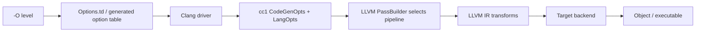

import Head from "@docusaurus/Head";
import Tabs from "@theme/Tabs";
import TabItem from "@theme/TabItem";
import FlagArticleShell from "@site/src/components/clang-flags/FlagArticleShell";
import AsmDiff from "@site/src/components/clang-flags/AsmDiff";
import SourceCode from "@site/src/components/clang-flags/SourceCode";
import KeyFacts from "@site/src/components/clang-flags/KeyFacts";

<Head>
  <meta name="keywords" content="clang optimization levels,clang -O0,clang -O1,clang -O2,clang -O3,clang -Os,clang -Oz,LLVM optimization passes,compiler optimization" />
  <meta property="og:title" content="-O: Clang optimization levels explained" />
  <meta property="og:description" content="How Clang optimization levels select LLVM passes and change code generation, compile time, and code size." />
  <meta property="og:type" content="article" />
  <meta name="twitter:card" content="summary" />
  <meta name="twitter:title" content="-O: Clang optimization levels explained" />
  <meta name="twitter:description" content="A compiler-engineering guide to Clang optimization levels and their tradeoffs." />
</Head>

{/* HAND_AUTHORED */}
<FlagArticleShell flagPath="-O" summary="Select the optimization pipeline Clang and LLVM use, trading compile time, debuggability, code size, and runtime performance.">

<div className="text--center margin-bottom--md">
  <a className="button button--primary button--lg" href="https://docs.google.com/forms/d/e/1FAIpQLSebP1JfLFDp0ckTxOhODKPNVeI1e21rUqMJ0fbBwJoaa-i4Yw/viewform" target="_blank" rel="noopener noreferrer" aria-label="Subscribe to CompilerSutra Weekly Compiler Notes">Subscribe to Weekly Compiler Notes</a>
  <p className="margin-top--sm">Practical LLVM, Clang, and compiler-engineering notes delivered weekly.</p>
</div>

## At a glance

| | |
| --- | --- |
| **Architecture** | Target-independent; target options still affect final machine code |
| **Category** | Optimization level |
| **Compiler** | Clang driver; levels use common GCC-compatible spellings |
| **Optimization** | Selects frontend/codegen defaults and the LLVM pass pipeline |
| **Risk** | Higher levels can increase compile time, code size, or expose undefined behavior |

:::note One-line summary
A bare `-O` means `-O1`; use an explicit level when the build policy needs a defined speed, size, or debugability tradeoff.
:::

## What this flag actually does

`-O` is the optimization-level family. Clang accepts `-O0`, bare `-O`/`-O1`, `-O2`, `-O3`, `-Os`, `-Oz`, and currently `-O4`. Bare `-O` is equivalent to `-O1`; `-O4` is currently equivalent to `-O3`. If multiple levels appear, the last effective level wins.

The driver converts the selected level into frontend and backend options and constructs the corresponding LLVM pass pipeline. `-O2` is not simply more of every optimization: `-O3` adds more expensive or code-size-increasing transformations, while `-Os` and `-Oz` bias decisions toward smaller code. The result also depends on the target triple, `-mcpu`/`-march`, language mode, floating-point options, LTO, and the source program.

:::caution Optimization does not define invalid programs
Optimization levels do not make signed overflow, invalid object lifetimes, data races, or strict-aliasing violations valid. More optimization can make the consequences of undefined behavior more visible.
:::

## Minimal example

This loop is small enough to inspect while still exposing the difference between stack-based unoptimized code and optimized/vectorized code.

<SourceCode file="sum.c" flag="-O" language="c" code={`int sum(int *a, int n) {
  int s = 0;
  for (int i = 0; i < n; ++i)
    s += a[i];
  return s;
}`} note="Compiled with Ubuntu Clang 18.1.3 for x86_64. The vector instructions are target-specific." />

## Before vs. after assembly

This is real `clang -S` output from Ubuntu Clang 18.1.3, target `x86_64-pc-linux-gnu`. The comparison uses `-O0` and `-O2` to show the family effect; the target page is `-O`, whose behavior is `-O1`.

<AsmDiff
  beforeTitle="-O0"
  afterTitle="-O2"
  before={`pushq %rbp
movq %rsp, %rbp
movq %rdi, -8(%rbp)
movl %esi, -12(%rbp)
movl $0, -16(%rbp)
movl $0, -20(%rbp)
.LBB0_1:
movl -20(%rbp), %eax
cmpl -12(%rbp), %eax
jge .LBB0_4
movq -8(%rbp), %rax
movslq -20(%rbp), %rcx
movl (%rax,%rcx,4), %eax
addl -16(%rbp), %eax
movl %eax, -16(%rbp)
addl $1, -20(%rbp)
jmp .LBB0_1
.LBB0_4:
movl -16(%rbp), %eax
popq %rbp
retq`}
  after={`testl %esi, %esi
jle .LBB0_1
movl %esi, %ecx
cmpl $8, %esi
jae .LBB0_4
xorl %edx, %edx
xorl %eax, %eax
.LBB0_5:
movdqu (%rdi,%rdx,4), %xmm0
paddd %xmm0, %xmm1
addq $4, %rdx
cmpq %rdx, %rcx
jne .LBB0_5`}
  note="Generated with Clang 18.1.3 using -S for x86_64-pc-linux-gnu. The -O2 excerpt highlights vectorized accumulation; the complete function includes cleanup and reduction."
/>

## Why use it and when not to

- Use `-O0` for fast compilation, debugging, and compiler investigations.
- Use `-O1` or bare `-O` when modest optimization is useful.
- Use `-O2` as a general release baseline, subject to measurement.
- Use `-O3` only when measurements show its additional transformations help.
- Use `-Os` or `-Oz` when code size and instruction-cache pressure matter.

:::important Make optimization a measured build policy
Do not choose `-O3` or `-Ofast` because the number is larger. Benchmark representative workloads and inspect binary size.
:::

## Performance impact

Higher levels generally cost more compile time. Runtime effects depend on hot loops, inlining, target ISA, code size, and the workload. This page omits `PerfReport` because no controlled CompilerSutraPerf matrix was actually run for this flag.

## Compatibility

| Compiler / mode | Support |
| --- | --- |
| Clang C/C++ | `-O0`, `-O`, `-O1`, `-O2`, `-O3`, `-Os`, `-Oz`, and currently `-O4` |
| GCC C/C++ | Common spellings; pass behavior differs |
| clang-cl | Uses `/O0`, `/O1`, and `/O2` conventions |
| Target triples | All targets; target flags still affect the result |

## Usage example

<Tabs>
  <TabItem value="debug" label="Debug">

```bash
clang -O0 -g -Wall -Wextra -c sum.c -o sum.o
```

  </TabItem>
  <TabItem value="release" label="Release">

```bash
clang -O2 -DNDEBUG -c sum.c -o sum.o
```

  </TabItem>
  <TabItem value="size" label="Size">

```bash
clang -Oz -DNDEBUG -c sum.c -o sum.o
```

  </TabItem>
</Tabs>

Inspect the selected frontend command with:

```bash
clang -O2 -### -c sum.c
```

## Adjacent options

- `-O0`, `-O1`, `-O2`, `-O3`, `-Os`, `-Oz`: explicit family members.
- `-Ofast`: deprecated aggressive mode combining `-O3` and fast-math behavior.
- `-g`: emits debug information; it does not imply `-O0`.
- `-flto`: creates cross-translation-unit optimization opportunities at link time.
- `-fno-vectorize`: disables a narrower transformation class.

## How it works inside Clang



The family is declared in [`Options.td:839-843`](https://github.com/llvm/llvm-project/blob/59e601a3d5e7669fdf809b9c6494e6f877ea5cd8/clang/include/clang/Driver/Options.td#L839-L843), with the driver-facing `-O` form at [`Options.td:9029`](https://github.com/llvm/llvm-project/blob/59e601a3d5e7669fdf809b9c6494e6f877ea5cd8/clang/include/clang/Driver/Options.td#L9029). The driver resolves the effective level and forwards frontend/code-generation state to `cc1`; LLVM PassBuilder then constructs the optimization pipeline. The target backend lowers transformed IR and does not independently interpret `-O2` as a source-language rule.

## Key facts

<KeyFacts items={[
  { label: "Bare form", value: "-O equals -O1" },
  { label: "General release baseline", value: "-O2, subject to measurement" },
  { label: "Size-oriented levels", value: "-Os and -Oz" },
  { label: "Debugging", value: "-O0 is easiest to debug; -g is independent" },
  { label: "ABI impact", value: "None by itself; code generation changes" },
]} />

</FlagArticleShell>
