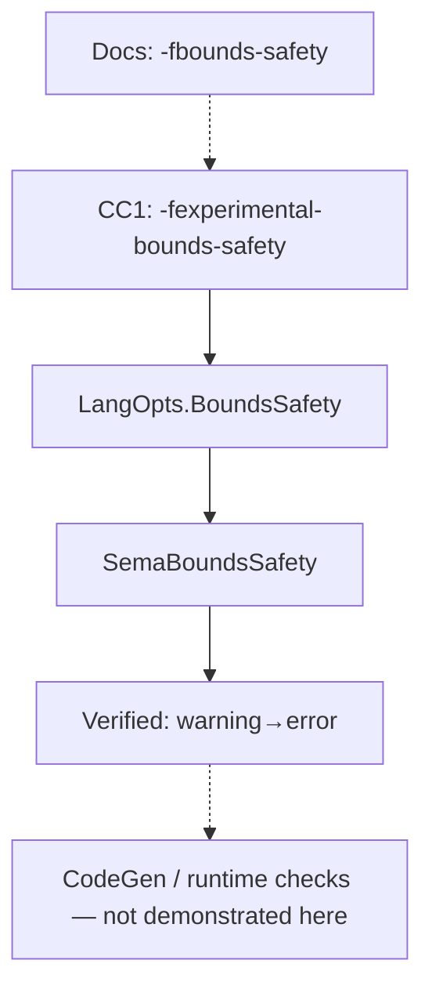

import Head from '@docusaurus/Head';
import FlagArticleShell from '@site/src/components/clang-flags/FlagArticleShell';
import Callout from '@site/src/components/clang-flags/Callout';
import SourceCode from '@site/src/components/clang-flags/SourceCode';
import KeyFacts from '@site/src/components/clang-flags/KeyFacts';
import DiagnosticCompare from '@site/src/components/clang-flags/DiagnosticCompare';
import CodeBlock from '@site/src/components/clang-flags/CodeBlock';

<Head>
  <meta name="keywords" content="clang,-fbounds-safety,-fexperimental-bounds-safety,-fno-bounds-safety,bounds safety,counted_by,sized_by,Sema,LangOpts,BoundsSafety" />
  <meta property="og:title" content="-fbounds-safety — Clang flag reference" />
  <meta property="og:description" content="LLVM's public bounds-safety language mode vs the CC1 option on Clang debad832: verified Sema warning→error for one __counted_by FAM pattern." />
  <meta property="og:type" content="article" />
  <meta name="twitter:card" content="summary" />
  <meta name="twitter:title" content="-fbounds-safety — Clang flag reference" />
  <meta name="twitter:description" content="LLVM's public bounds-safety language mode vs the CC1 option on Clang debad832: verified Sema warning→error for one __counted_by FAM pattern." />
</Head>

{/* HAND_AUTHORED */}
<FlagArticleShell flagPath="-fbounds-safety" summary="LLVM documents -fbounds-safety as the public C bounds-safety language mode; Clang 24.0.0git (debad832) enables it through CC1 -fexperimental-bounds-safety, with verified Sema effects on one __counted_by pattern.">

<div className="text--center margin-bottom--md"><a className="button button--primary button--lg" href="https://docs.google.com/forms/d/e/1FAIpQLSebP1JfLFDp0ckTxOhODKPNVeI1e21rUqMJ0fbBwJoaa-i4Yw/viewform" target="_blank" rel="noopener noreferrer" aria-label="Subscribe to CompilerSutra Weekly Compiler Notes">✉ Subscribe to Weekly Compiler Notes</a><p className="margin-top--sm">Practical LLVM, Clang, and compiler-engineering notes delivered weekly.</p></div>

## At a glance

| | |
| --- | --- |
| **Site category** | Code Generation *(LLVM TableGen grouping)* |
| **Primary stage** | Frontend / **Sema** |
| **Docs language-mode name** | `-fbounds-safety` — [BoundsSafety.html](https://clang.llvm.org/docs/BoundsSafety.html) |
| **CC1 option (`debad832`)** | `-fexperimental-bounds-safety` → `LangOpts.BoundsSafety` |
| **Driver forwarding (`debad832`)** | `-Xclang -fexperimental-bounds-safety` |
| **Option definition (`debad832`)** | [`Options.td` L2070–L2076](https://github.com/compilersutra/llvm-project/blob/debad8323724adb0682eb3d9cb0940b137b24e8a/clang/include/clang/Options/Options.td#L2070-L2076) |
| **Compiler tested** | Clang **24.0.0git** (`debad832`) — `/home/aitr/osc/llvm-project/build/bin/clang` |
| **Verified on this page** | Warning → error for one `__counted_by` / FAM layout |

<Callout tone="info" title="Experimental status — read once">

LLVM documents a public bounds-safety **language mode** in [BoundsSafety.html](https://clang.llvm.org/docs/BoundsSafety.html). On Clang commit **debad832**, that mode is enabled through a **CC1-only** implementation flag — not through a bare driver spelling of the documented name.

| Name | Role on debad832 |
| --- | --- |
| `-fbounds-safety` | Documented/public language-mode name *(not accepted as a driver or cc1 flag)* |
| `-fexperimental-bounds-safety` | CC1 switch that sets `LangOpts.BoundsSafety` |
| `-fno-bounds-safety` | Documented/public negation name *(not accepted as a bare cc1 flag)* |
| `-fno-experimental-bounds-safety` | CC1 negation accepted on debad832 |

**What this page covers**

- **Documented model:** wide pointers, run-time checks, traps — still evolving ([implementation plans](https://clang.llvm.org/docs/BoundsSafetyImplPlans.html)).
- **Verified on debad832:** frontend/Sema only — warning→error promotion for the flexible-array example below. Does not claim full run-time bounds checking in this snapshot.

**Enable on debad832**

```bash
clang -cc1 -std=c11 -fexperimental-bounds-safety -fsyntax-only file.c
clang -std=c11 -Xclang -fexperimental-bounds-safety -fsyntax-only file.c
```

</Callout>

## What this flag actually does

### Documented model ([BoundsSafety.html](https://clang.llvm.org/docs/BoundsSafety.html))

The design describes annotated C (`__counted_by`, `__sized_by`), possible wide-pointer representations for some locals, compile-time rejection of uncheckable code, and **run-time bounds checking with traps** — part of an **evolving code-generation implementation** ([impl plans](https://clang.llvm.org/docs/BoundsSafetyImplPlans.html)).

### Verified on `debad832`

| Default | Bounds safety enabled |
| --- | --- |
| Some invalid layouts emit **warnings** | Same layouts become **errors** |
| Looser incomplete-pointee rules | Stricter assignment / initialization / use checks |

`__counted_by` associates a pointer or array bound with a count expression (typically a field in the containing object). The annotation is represented in Clang's **attributed type system** in both modes; enabling bounds safety changes the **semantic checks** applied to those types.

## Source-level view (`debad832`)

Expected option-processing path (cc1 option marshalling → language options → Sema). Only the **Options.td → LangOpts → Sema** links and the diagnostic outcome below were checked against this commit.

<CodeBlock title="Options.td — experimental-bounds-safety (L2070–L2076)" language="text" code={`defm bounds_safety : BoolFOption<
  "experimental-bounds-safety",
  LangOpts<"BoundsSafety">, DefaultFalse,
  PosFlag<SetTrue, [], [CC1Option], "Enable">,
  NegFlag<SetFalse, [], [CC1Option], "Disable">,
  BothFlags<[], [CC1Option],
          " experimental bounds safety extension for C">>;`} />

<CodeBlock title="LangOptions.def — L523" language="text" code={`LANGOPT(BoundsSafety, 1, 0, NotCompatible, "Bounds safety extension for C")`} />

<CodeBlock title="SemaBoundsSafety.cpp — warning vs error (~L157–176)" language="cpp" code={`if (FieldTy->isArrayType() && !getLangOpts().BoundsSafety) {
  // Linux-kernel migration path: downgrade to warning when mode is off
  ShouldWarn = true;
}
...
unsigned DiagID = ShouldWarn
    ? diag::warn_counted_by_attr_elt_type_unknown_size
    : diag::err_counted_by_attr_pointee_unknown_size;`} />

## Minimal realistic example

From [`attr-counted-by-bounds-safety-vlas.c`](https://github.com/llvm/llvm-project/blob/59e601a3d5e7669fdf809b9c6494e6f877ea5cd8/clang/test/Sema/attr-counted-by-bounds-safety-vlas.c): an outer flexible array whose elements contain their own flexible array member, annotated with `__counted_by`.

<SourceCode
  file="bounds_safety_fam.c"
  flag="-fbounds-safety"
  language="c"
  code={`#define __counted_by(f) __attribute__((counted_by(f)))

struct inner_fam {
  int count;
  char data[];
};

struct outer_buf {
  int count;
  struct inner_fam arr[] __counted_by(count);
};`}
  note="count refers to a field in the containing struct, allowing Clang to associate the counted_by bound with the corresponding object layout."
/>

## Before vs. after: compiler diagnostics

Commands use **`-fsyntax-only`** on purpose: they stop after frontend/Sema and do not run optimization, code generation, assembly, or linking — so the experiment isolates **diagnostic behavior**, not machine code.

| Aspect | Default | Bounds safety enabled |
| --- | --- | --- |
| **Severity** | Warning (`-Wbounds-safety-counted-by-elt-type-unknown-size`) | Hard error |
| **Source line** | `struct inner_fam arr[] __counted_by(count);` (line 10) | Same |
| **CC1 switch** | *(none)* | `-fexperimental-bounds-safety` |

<DiagnosticCompare
  beforeTitle="Default mode"
  afterTitle="Bounds safety enabled"
  beforeCommand="clang -cc1 -std=c11 -fsyntax-only bounds_safety_fam.c"
  afterCommand="clang -cc1 -std=c11 -fexperimental-bounds-safety -fsyntax-only bounds_safety_fam.c"
  driverHint="clang -std=c11 -Xclang -fexperimental-bounds-safety -fsyntax-only bounds_safety_fam.c"
  takeaway="Same source line and caret — warning→error promotion for this FAM + __counted_by pattern only."
  before={`bounds_safety_fam.c:10:3: warning: 'counted_by' should not be applied to an array with element of unknown size because 'struct inner_fam' is a struct type with a flexible array member. This will be an error in a future compiler version [-Wbounds-safety-counted-by-elt-type-unknown-size]
   10 |   struct inner_fam arr[] __counted_by(count);
      |   ^~~~~~~~~~~~~~~~~~~~~~
1 warning generated.`}
  after={`bounds_safety_fam.c:10:3: error: 'counted_by' cannot be applied to an array with element of unknown size because 'struct inner_fam' is a struct type with a flexible array member
   10 |   struct inner_fam arr[] __counted_by(count);
      |   ^~~~~~~~~~~~~~~~~~~~~~
1 error generated.`}
  note="Clang 24.0.0git (debad832), x86_64-unknown-linux-gnu."
/>

:::note Why this example does not demonstrate a code-generation difference
This case stops in **Sema** (warning or error) before a meaningful assembly comparison exists:

```text
source → parser → Sema → diagnostic
                      ↘ CodeGen / LLVM IR / machine code — not reached here
```

Run-time checks and traps belong to the **documented design**; they are **not demonstrated** by this `-fsyntax-only` experiment.
:::

## When to use it

- Adopting the [bounds-safety C model](https://clang.llvm.org/docs/BoundsSafety.html) incrementally ([adoption guide](https://clang.llvm.org/docs/BoundsSafetyAdoptionGuide.html)).
- You need the compiler to reject layouts where bound size cannot be computed from complete type information.
- You can compile the **relevant** C translation units with the same bounds-safety configuration when they share bounds-annotated interfaces.

## When not to use it

- **Mixed builds:** TUs with and without bounds safety can disagree on whether the same header is ill-formed.
- **C++ modes:** bounds safety targets **C** in LLVM's model. **Lifetime Safety** (`-fexperimental-lifetime-safety`) is a **separate** C++ object-lifetime model — not a C++ spelling of bounds safety.
- **Packaged Clang:** availability depends on the LLVM version in your toolchain — check with `clang -cc1 -help | rg bounds-safety` or equivalent.
- **Expecting full run-time enforcement today:** for accesses not currently instrumented or otherwise protected by the experimental implementation, ordinary C undefined-behavior rules still apply. Bounds-safety rules, AddressSanitizer, and `-fsanitize=bounds` are different mechanisms.

:::caution
Bounds-safety rules impose additional constraints on operations that can lose or obscure bounds information, including certain pointer conversions and uses of count-attributed pointers (see [`SemaBoundsSafety.cpp`](https://github.com/compilersutra/llvm-project/blob/debad8323724adb0682eb3d9cb0940b137b24e8a/clang/lib/Sema/SemaBoundsSafety.cpp) — assignment, initialization, and use checks when `BoundsSafety` is on).
:::

## Performance impact

On `debad832`, the flag mainly adds **frontend/Sema** work. No stable run-time overhead was measured — the verified delta here is diagnostic, not benchmarkable.

## Compatibility

| | |
| --- | --- |
| **Docs language-mode name** | `-fbounds-safety` |
| **CC1 enable (`debad832`)** | `-fexperimental-bounds-safety` |
| **CC1 disable (`debad832`)** | `-fno-experimental-bounds-safety` |
| **Documented negation name** | `-fno-bounds-safety` *(not accepted as a bare cc1/driver flag on `debad832`)* |
| **C** | Intended language for bounds safety |

## Usage example

```bash
CLANG=/home/aitr/osc/llvm-project/build/bin/clang

# Default — warning
$CLANG -cc1 -std=c11 -fsyntax-only bounds_safety_fam.c

# Enable bounds-safety mode — error on the same line
$CLANG -cc1 -std=c11 -fexperimental-bounds-safety -fsyntax-only bounds_safety_fam.c

# Driver forwarding
$CLANG -std=c11 -Xclang -fexperimental-bounds-safety -fsyntax-only bounds_safety_fam.c

# Disable (CC1 spelling accepted on debad832)
$CLANG -cc1 -std=c11 -fno-experimental-bounds-safety -fsyntax-only bounds_safety_fam.c
```

Include [`ptrcheck.h`](https://clang.llvm.org/docs/BoundsSafetyAdoptionGuide.html) when adopting the documented macro spellings for annotated C.

## Adjacent options

| Option | Relationship |
| --- | --- |
| `-fno-bounds-safety` / `-fno-experimental-bounds-safety` | Documented negation vs CC1 negation on `debad832` (see Compatibility). |
| `-fexperimental-lifetime-safety` | **Different model** — C++ lifetime / dangling-reference checks. |
| `-Wbounds-safety-counted-by-elt-type-unknown-size` | Warning in default mode; error when bounds safety is on. |
| `-fsanitize=address` / `-fsanitize=bounds` | Separate run-time sanitizers. |

## How it works inside Clang



| Stage | Source (`debad832`) | Role |
| --- | --- | --- |
| Option | [`Options.td` L2070–L2076](https://github.com/compilersutra/llvm-project/blob/debad8323724adb0682eb3d9cb0940b137b24e8a/clang/include/clang/Options/Options.td#L2070-L2076) | `experimental-bounds-safety` → `LangOpts.BoundsSafety`; `CC1Option` only |
| Language opt | [`LangOptions.def` L523](https://github.com/compilersutra/llvm-project/blob/debad8323724adb0682eb3d9cb0940b137b24e8a/clang/include/clang/Basic/LangOptions.def#L523) | `LANGOPT(BoundsSafety, …)` |
| Sema | [`SemaBoundsSafety.cpp`](https://github.com/compilersutra/llvm-project/blob/debad8323724adb0682eb3d9cb0940b137b24e8a/clang/lib/Sema/SemaBoundsSafety.cpp) | Verified diagnostic promotion (~L157–176) |
| Backend | LLVM IR pipeline | Consumes generated IR; bounds safety is configured in the **frontend/CC1** layer, not via a driver `-fbounds-safety` spelling |

## Key facts

<KeyFacts
  items={[
    { label: 'Docs language-mode name', value: '-fbounds-safety', icon: 'info' },
    { label: 'CC1 option (debad832)', value: '-fexperimental-bounds-safety', icon: 'check' },
    { label: 'CC1 negation (debad832)', value: '-fno-experimental-bounds-safety', icon: 'check' },
    { label: 'Verified effect', value: 'Sema warning→error (one pattern)', icon: 'check' },
    { label: 'Option definition', value: 'Options.td L2070–2076', icon: 'info' },
  ]}
/>

</FlagArticleShell>
